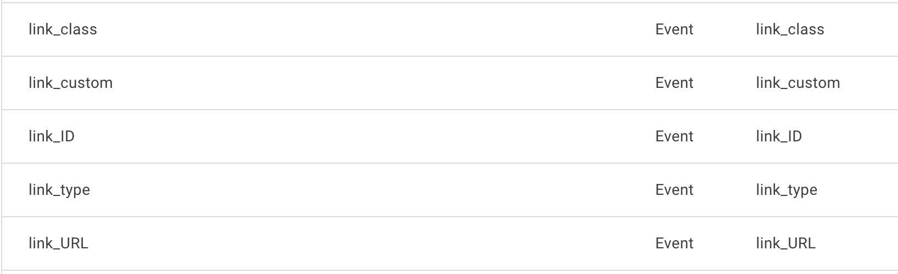

# GA4 Anchor Clicks

This short js file will add an event listener to all anchor tags (`<a>`) on the page and send GA4 events when clicked (or auxclicked).

# Usage & Options

You can format an anchor tag as follows, which will send 5 pieces of data along with the custom event:
```
<a id="link1" class="blue ga-okgoogle" data-ga-custom="pizza" href="https://google.com">google</a>
```
* `link_class` - will be sent if there is a class with the prefix `ga-` in it. In the above example, 'okgoogle' would be sent but 'blue' would not be sent
* `link_ID` - will be sent if there is a value for id (remember these need to be unique for the page)
* `link_URL` - will send the full href value
* `link_type` - if href.hostname == location.hostname, will send 'internal' and if not, 'external'
* `link_custom` - if a the 'data-ga-custom' attribute exists, the value will be sent (in example would send 'pizza')

# Recommended

To be able to run reports on this data, you will need to establish the above custom parameters as "Custom Dimensions" in your GA4 admin dashboard.

